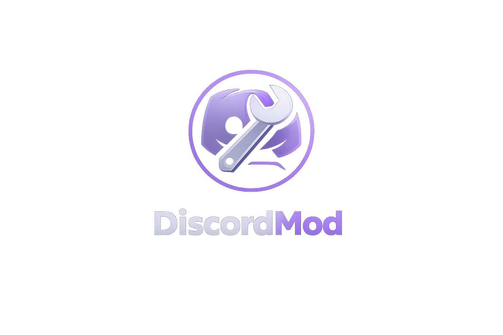

# DiscordMod

<div align="center">



### A customizable Discord modification manager

Install, manage, and customize Discord with ease.

---


<br>


</div>

---

## Features

* Easy Discord mod installation
* Modern and lightweight interface
* Automatic dependency management
* Fast updates
* Open source
* Beginner friendly

---

## Requirements

Before building, install:

* Git
* JDK 17+
* Android SDK
* Android Studio (recommended)

---

## Building

### Clone the repository

```bash
git clone https://github.com/bluenotthecolor/DiscordMod.git
cd DiscordMod
```

### Build

#### Windows

```bash
gradlew assembleDebug
```

#### Linux

```bash
chmod +x gradlew
./gradlew assembleDebug
```

### Install

Enable USB debugging on your Android device and run:

```bash
adb install app/build/outputs/apk/debug/app-debug.apk
```

---

## Project Structure

```text
DiscordMod/
├── app/
├── assets/
├── images/
├── gradle/
├── build.gradle
├── settings.gradle
└── README.md
```

---

## Contributing

Contributions are welcome.

You can help by:

* Reporting bugs
* Suggesting features
* Improving documentation
* Creating pull requests

---

## License

This project is licensed under the Open Software License 3.0 (OSL-3.0).

See the LICENSE file for details.

---

<div align="center">

Made with by the DiscordMod Team

</div>
